# Skills 加载逻辑重构计划

## Skills 加载流程图



上图展示了 Skills 系统的完整加载流程，包括以下关键阶段：

1. **缓存检查**：首先检查是否有缓存的结果，避免重复加载
2. **发现阶段（Discovery）**：
   - 解析根路径（Repo/User/System/Admin 四个作用域）
   - 使用 BFS 算法扫描目录树
   - 将发现的技能文件映射到对应的作用域
3. **解析阶段（Parse）**：
   - 解析 SKILL.md 文件，提取 YAML frontmatter
   - 解析 agents/openai.yaml 元数据文件
   - 合并两个来源的元数据
4. **验证阶段（Validate）**：
   - 使用 Zod Schema 验证元数据结构
   - 检查技能是否启用（enabled 字段）
   - 记录验证失败的警告
5. **结果处理**：
   - 去重和排序（按作用域优先级和名称）
   - 缓存结果以供后续使用
   - 发出 loadComplete 事件

## 重构目标

将 skills 加载逻辑重构为更加清晰、模块化、可扩展的架构，解决以下问题：

1. **配置硬编码**：`.codex`、`SKILL.md`、`agents/openai.yaml` 等都是硬编码常量
2. **职责混乱**：`loader.ts` 同时负责文件发现、路径解析、内容解析、元数据加载
3. **缺乏抽象层**：没有将"发现策略"、"解析策略"、"配置源"等抽象出来
4. **错误处理粗糙**：大量 `try-catch` 且静默失败，错误信息不够详细
5. **缺乏日志系统**：加载过程不可观测
6. **类型安全不足**：大量使用 `any` 类型解析 YAML
7. **扩展性差**：添加新的技能格式或元数据来源需要修改核心逻辑

---

## 新的目录结构

```
src/core/skills/
├── index.ts                    # 公共 API 导出
│
├── core/                       # 核心类型定义
│   ├── types.ts                # SkillMetadata、SkillScope 等核心类型
│   ├── errors.ts               # 错误类型定义
│   └── events.ts               # 事件类型定义
│
├── config/                     # 配置系统
│   ├── index.ts                # 配置管理器
│   ├── defaults.ts             # 默认配置
│   └── schema.ts               # 配置 schema (Zod)
│
├── discovery/                  # 技能发现层
│   ├── index.ts                # 发现协调器
│   ├── scanner.ts              # 文件系统扫描器
│   ├── resolver.ts             # 根路径解析器
│   └── strategies/             # 发现策略
│       └── file-system.ts      # 基于文件系统的发现
│
├── parsers/                    # 解析层
│   ├── index.ts                # 解析器协调器
│   ├── base.ts                 # 抽象解析器基类
│   ├── markdown.ts             # Markdown + YAML frontmatter 解析器
│   ├── yaml-metadata.ts        # YAML 元数据解析器
│   └── factory.ts              # 解析器工厂
│
├── loaders/                    # 加载层
│   ├── index.ts                # 加载器协调器
│   └── skill-loader.ts         # 技能加载器实现
│
├── cache/                      # 缓存系统
│   ├── index.ts                # 缓存管理器
│   ├── memory-cache.ts          # 内存缓存实现
│   └── interface.ts            # 缓存接口定义
│
├── validation/                 # 验证系统
│   ├── index.ts                # 验证协调器
│   ├── skill-validator.ts      # 技能数据验证器
│   └── schema.ts               # Zod 验证 schema
│
├── utils/                      # 工与其他函数
│   ├── path.ts                 # 路径处理工具
│   ├── fs.ts                   # 文件系统工具
│   └── logger.ts               # 日志工具
│
├── manager.ts                  # SkillsManager（对外主最口）
└── types.ts                    # 向后兼容的类型导出
```

---

## 重构步骤

### 阶段 1：基础设施

1. 创建新的目录结构
   - `src/core/skills/core/`
   - `src/core/skills/config/`
   - `src/core/skills/discovery/strategies/`
   - `src/core/skills/parsers/`
   - `src/core/skills/loaders/`
   - `src/core/skills/cache/`
   - `src/core/skills/validation/`
   - `src/core/skills/utils/`

2. 实现配置系统
   - `config/defaults.ts` - 定义默认配置（保持与现有行为一致）
   - `config/schema.ts` - 定义 Zod 配置 schema
   - `config/index.ts` - 配置管理器类

3. 实现日志系统
   - `utils/logger.ts` - Logger 接口和 DefaultLogger 类

### 阶段 2：核心类型

4. 迁移和增强类型定义
   - `core/types.ts` - 从现有 `types.ts` 迁移，添加新字段（version、author、tags、enabled）
   - `core/errors.ts` - 定义 SkillLoadError、SkillParseError、SkillValidationError
   - `core/events.ts` - 定义事件类型（loadStart、loadComplete、parseComplete 等）

### 阶段 3：发现层

5. 实现文件系统扫描器
   - `discovery/scanner.ts` - BFS 扫描逻辑（从 `loader.ts:discoverSkillsUnderRoot` 提取）

6. 实现根路径解析器
   - `discovery/resolver.ts` - 项目根查找和作用域解析（从 `manager.ts:resolveRoots` 提取）

7. 实现发现策略
   - `discovery/strategies/file-system.ts` - 文件系统发现策略

8. 创建发现协调器
   - `discovery/index.ts` - DiscoveryCoordinator 类

### 阶段 4：解析层

9. 实现解析器基类
   - `parsers/base.ts` - 抽象 SkillParser 类

10. 实现 Markdown 解析器
    - `parsers/markdown.ts` - 解析 SKILL.md 文件（从 `loader.ts:parseSkillFile` 提取）

11. 实现 YAML 元数据解析器
    - `parsers/yaml-metadata.ts` - 解析 agents/openai.yaml（从 `loader.ts:loadSkillMetadata` 提取）

12. 创建解析器工厂
    - `parsers/factory.ts` - 根据文件类型选择解析器

13. 创建解析器协调器
    - `parsers/index.ts` - ParserCoordinator 类

### 阶段 5：验证系统

14. 实现 Zod 验证 schema
    - `validation/schema.ts` - 完整的验证规则（使用 zod）

15. 实现验证器
    - `validation/skill-validator.ts` - SkillValidator 类

16. 创建验证协调器
    - `validation/index.ts` - 导出验证接口

### 阶段 6：缓存系统

17. 实现缓存接口
    - `cache/interface.ts` - ICache 接口定义

18. 实现内存缓存
    - `cache/memory-cache.ts` - MemoryCache 实现（支持 TTL）

19. 创建缓存管理器
    - `cache/index.ts` - CacheManager 类

### 阶段 7：加载层

20. 实现技能加载器
    - `loaders/skill-loader.ts` - 完整的加载流程（编排发现、解析、验证）

21. 创建加载器协调器
    - `loaders/index.ts` - 导出加载接口

### 阶段 8：管理器重构

22. 重构 SkillsManager
    - 保持公共接口不变
    - 内部使用新的模块化组件

### 阶段 9：向后兼容

23. 更新类型导出
    - 保留 `types.ts` 作为兼容层，从新模块重新导出

### 阶段 10：清理

24. 删除旧文件
    - 删除 `loader.ts`

---

## 关键设计要点

### 配置化

```typescript
export interface SkillsConfig {
  directories: {
    homeDir: string;
    userSkillsDir: string;
    systemSkillsDir: string;
    projectMarker: string[];
  };
  filenames: {
    skillFile: string;
    metadataDir: string;
    metadataFile: string;
  };
  scanning: {
    maxDepth: number;
    maxDirsPerRoot: number;
    followSymlinks: boolean[];
  };
  cache: {
    enabled: boolean;
    ttl: number;
  };
}
```

### 默认配置（保持向后兼容）

```typescript
export const DEFAULT_CONFIG: SkillsConfig = {
  directories: {
    homeDir: path.join(os.homedir(), '.codex'),
    userSkillsDir: 'skills',
    systemSkillsDir: 'skills/.system',
    projectMarker: ['.git', '.codex', '.agents'],
  },
  filenames: {
    skillFile: 'SKILL.md',
    metadataDir: 'agents',
    metadataFile: 'openai.yaml',
  },
  scanning: {
    maxDepth: 6,
    maxDirsPerRoot: 2000,
    followSymlinks: [true, true, false, true], // Repo, User, System, Admin
  },
  cache: {
    enabled: true,
    ttl: 300000, // 5 分钟 in milliseconds
  },
};
```

### 公共接口（保持不变）

```typescript
class SkillsManager {
  constructor(codexHome: string);
  getSkillsForCwd(cwd: string, forceReload?: boolean): SkillLoadOutcome;
  clearCache(): void;
}
```

---

## 关键文件清单

### 需要创建的文件

```
src/core/skills/core/types.ts
src/core/skills/core/errors.ts
src/core/skills/core/events.ts
src/core/skills/config/index.ts
src/core/skills/config/defaults.ts
src/core/skills/config/schema.ts
src/core/skills/discovery/index.ts
src/core/skills/discovery/scanner.ts
src/core/skills/discovery/resolver.ts
src/core/skills/discovery/strategies/file-system.ts
src/core/skills/parsers/index.ts
src/core/skills/parsers/base.ts
src/core/skills/parsers/markdown.ts
src/core/skills/parsers/yaml-metadata.ts
src/core/skills/parsers/factory.ts
src/core/skills/loaders/index.ts
src/core/skills/loaders/skill-loader.ts
src/core/skills/cache/index.ts
src/core/skills/cache/memory-cache.ts
src/core/skills/cache/interface.ts
src/core/skills/validation/index.ts
src/core/skills/validation/skill-validator.ts
src/core/skills/validation/schema.ts
src/core/skills/utils/path.ts
src/core/skills/utils/fs.ts
src/core/skills/utils/logger.ts
```

### 需要修改的文件

```
src/core/skills/manager.ts    # 重构内部实现
src/core/skills/types.ts       # 改为兼容层
```

### 需要删除的文件

```
src/core/skills/loader.ts      # 逻辑拆分到新模块
```

### 集成点

```
src/core/agent/index.ts       # 确保 SkillsManager 兼容性
src/core/tools/skills.ts       # 更新类型导入路径
```

---

## 验证步骤

1. 运行 `bun run src/index.ts` 确保应用正常启动
2. 验证 skills 能被正确加载（包括 .codex/skills 和项目级 skills）
3. 测试缓存机制（多次调用 `getSkillsForCwd` 应使用缓存）
4. 测试 `forceReload` 参数（应强制重新加载）
5. 验证元数据解析（SKILL.md + agents/openai.yaml）
6. 验证技能依赖处理（MCP 服务器动态加载）

---

## 依赖说明

- **js-yaml**：已存在，用于 YAML 解析
- **zod**：可能需要添加，用于运行时类型验证

### 检查 zod 是否已安装

```bash
bun pm ls zod
```

如果没有安装，需要运行：
```bash
bun add zod
```
